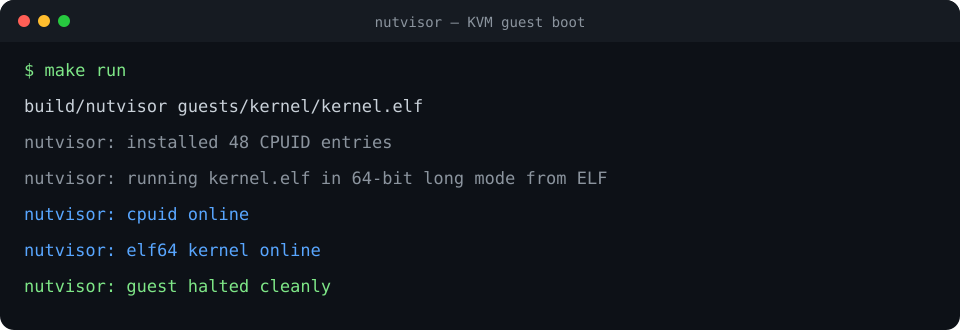
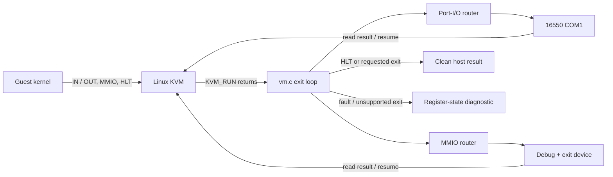

<h1 align="center">nutvisor</h1>

<p align="center">
  <em>A type-2 hypervisor written from scratch in C, using the Linux KVM API to
  run a guest on real hardware virtualization and boot its own ELF64 kernel.</em>
</p>

<p align="center">
  
  
  
  
</p>

<p align="center">
  <a href="docs/assets/demo.cast">
    
  </a>
</p>

<p align="center">
  <sub>Actual local KVM run · click the terminal for the asciinema v2 recording</sub>
</p>

---

## What this is

nutvisor is a Virtual Machine Monitor (VMM): the program that *is* the "VM" when
you run one. Through Linux's `/dev/kvm`, it asks Intel VT-x to run guest code
directly on the silicon, and it services every **VM exit**
the guest triggers: port I/O, memory-mapped I/O, halts, and faults. It creates
the guest's memory, sets up its virtual CPU, loads guest code, and emulates the
devices the guest talks to (starting with a serial port).

It is the companion to [Nutshell](https://github.com/MokiMeow/nutshell), the
from-scratch kernel, and
its endgame is to **boot that kernel as its guest**: *"I wrote the VM and the OS
it runs."*

```
   host (Linux/WSL2)                         guest
 +-------------------+   ioctl(KVM_RUN)   +--------------+
 |     nutvisor      | -----------------> |  guest code  |
 |  - guest memory   |                    |  (real mode, |
 |  - vCPU setup     |   <-- VM exit ---  |   long mode, |
 |  - device model   |   I/O, MMIO, HLT   |   a kernel)  |
 +-------------------+                    +--------------+
        /dev/kvm  <---- VT-x ----> physical CPU
```

## How a VM exit flows



The vCPU runs natively until hardware exits to KVM. `vm.c` reads the shared
`kvm_run` reason, routes device accesses without device-specific branches, and
calls `KVM_RUN` again. See [the KVM API walkthrough](docs/03-kvm-api.md).

## Why it is interesting (the depth on show)

- **The KVM API, by hand**: `KVM_CREATE_VM`, guest memory regions, `KVM_CREATE_VCPU`,
  the shared `kvm_run` structure, and the `KVM_RUN` exit loop.
  ([docs/03-kvm-api.md](docs/03-kvm-api.md))
- **VM exits**: turning a guest's `out dx, al` into a character, its MMIO into a
  device access, its `hlt` into a clean stop, and its faults into readable
  diagnostics. ([docs/07-device-emulation.md](docs/07-device-emulation.md))
- **CPU modes from the outside**: putting a vCPU into real mode, then building
  the GDT and page tables to bring a guest up into 64-bit long mode.
  ([docs/06-vcpu-and-modes.md](docs/06-vcpu-and-modes.md))
- **Loading a real kernel**: parsing an ELF64 image into guest-physical memory
  and jumping to its entry point. ([docs/08-elf-loading.md](docs/08-elf-loading.md))

## Quick start (WSL2 / Linux with nested virtualization, $0)

```bash
./scripts/setup-kvm.sh   # ensure /dev/kvm is available (loads the module)
make run                 # build the VMM + guests and boot the ELF64 kernel
```

Expected output:

```
nutvisor: installed ... CPUID entries
nutvisor: running guests/kernel/kernel.elf (...) in 64-bit long mode from ELF
nutvisor: cpuid online
nutvisor: elf64 kernel online
nutvisor: guest halted cleanly
```

That line came *from inside a VM your program created*. See
[docs/01-getting-started.md](docs/01-getting-started.md) for the nested-virt
requirements (Windows 11 + WSL2 exposes VT-x by default).

## Status

nutvisor v1.0.0 is complete: it installs a coherent KVM CPUID table, validates
and loads an ELF64 kernel, enters it in long mode, services port-I/O and MMIO
devices, and emits full state for every failure exit. `make test` boots every
guest and verifies both success and deliberate-failure paths.

| # | Milestone | State |
|---|-----------|-------|
| 0 | KVM bring-up + real-mode "hello" guest | ✅ done |
| 1 | Serial device model + port-I/O dispatch | ✅ done |
| 2 | 64-bit long-mode guest (GDT + paging setup) | ✅ done |
| 3 | Memory-mapped I/O device emulation | ✅ done |
| 4 | ELF64 guest loader (boot a kernel from a file) | ✅ done |
| 5 | CPUID filtering + robust exit handling | ✅ done |
| 6 | Tests, CI, demo, `v1.0.0` (stretch: boot Nutshell) | ✅ done |

## Limitations

nutvisor targets x86-64 Linux hosts with KVM and currently runs one vCPU. Its
device model is deliberately small: COM1, the documented port-I/O routes, and
the debug/exit MMIO device. It does not provide production isolation, live
migration, snapshots, PCI, networking, storage devices, or a general firmware
stack. Guest inputs should be treated as trusted demonstration workloads.

## Repository layout

```
nutvisor/
├── src/          # the VMM (C, auto-discovered by the Makefile)
├── include/      # VMM headers
├── guests/       # guest programs the VMM runs (asm/C)
├── scripts/      # KVM setup and end-to-end self-test
├── docs/         # KVM API, architecture, roadmap, milestones, ADRs
└── Makefile      # all / test / run / check-kvm / clean
```

## Requirements

A Linux host (or Windows 11 + WSL2) with **nested virtualization** and
`/dev/kvm`. `make run` loads the KVM module automatically if it is missing; see
[docs/01-getting-started.md](docs/01-getting-started.md) if `/dev/kvm` cannot be
created.

## Documentation

Start with the [overview](docs/00-overview.md) and
[architecture](docs/02-architecture.md), then follow the
[KVM API](docs/03-kvm-api.md), [guest memory](docs/05-guest-memory.md),
[vCPU modes](docs/06-vcpu-and-modes.md),
[device emulation](docs/07-device-emulation.md), and
[ELF loading](docs/08-elf-loading.md) guides. Runtime verification and
debugging are covered in [docs/09](docs/09-testing-and-debugging.md).

## License

MIT: see [LICENSE](LICENSE).
